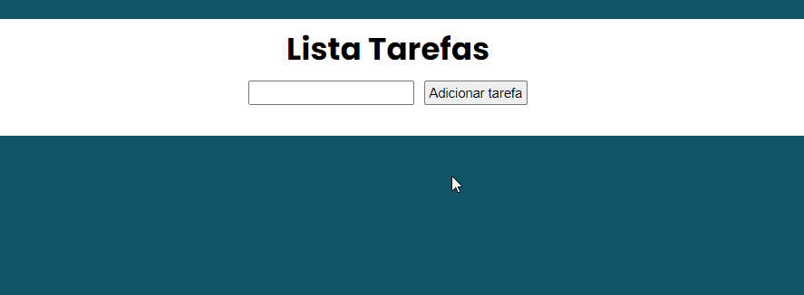

<h1 align="center">Lista de Tarefas</h1>
<h2 align="center">Projeto produzido para praticar HTML, CSS e JavaScript</h2>
 

    

<h2>🚀🚀 Tecnologias 🚀🚀</h2>

* ✅ HTML
* ✅ CSS
* ✅ JavaScript

 

<h2> Aprendizado com este Projeto </h2>

* ✅ Manipulação do DOM
* ✅ Eventos de Click e Teclado (KeyPress)
* ✅ Propriedades createElement, SetAttribute, addEventListener e createElement
* ✅ Introdução ao LocalStorage
* ✅ Salvar arquivos, deletar Arquivos

 

<h2> 💻📲 Como usar 💻📲 </h2>

* 📱💻 Baixe o Zip e execute o Index.html
